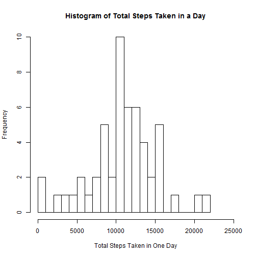
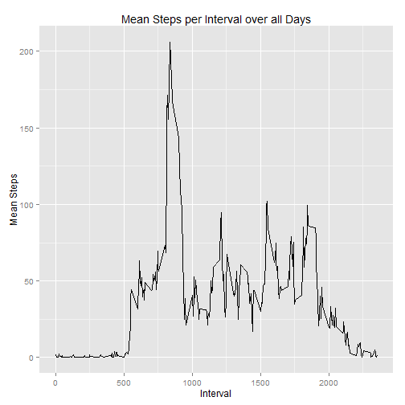
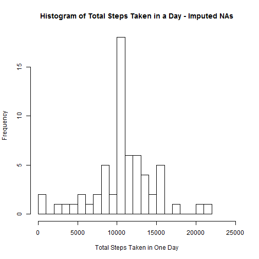

# Reproducible Research  
# Peer Assessment 1  
by: Matt Marchand  
last updated: 11/9/2014  
===============================================================================  
  
## Part 1  
### Load & Preprocess Data

```r
    library(data.table)
```

```
## data.table 1.9.4  For help type: ?data.table
## *** NB: by=.EACHI is now explicit. See README to restore previous behaviour.
```

```r
    library(ggplot2) 

    setwd("C:/Users/Matt/Desktop/Coursera/Reproducible Research")
    activity_data <- read.csv("activity.csv")
```
## Part 2  
### What is mean total number of steps taken per day?  
For this part of the assignment, you can ignore the missing values in the dataset.   

    1. Make a histogram of the total number of steps taken each day.        

```r
    steps_for_hist <- aggregate(steps ~ date, activity_data, sum)
    hist(steps_for_hist$steps, 
        main = "Histogram of Total Steps Taken in a Day", 
        breaks = 25, 
        xlab = "Total Steps Taken in One Day",
        ylab = "Frequency",
        xlim = c(0, 25000))
```

 
    
    2. Calculate and report the mean and median total number of steps taken per day.  

```r
    mean_steps <- mean(steps_for_hist$steps)
    median_steps <- median(steps_for_hist$steps)
```
The mean total steps per day is: 10766.19  
The median total steps per day is: 10765

## Part 3  
### What is the average daily activity pattern?     
    1. Make a time series plot (i.e. type = "l") of the 5-minute interval  
       (x-axis) and the average number of steps taken, averaged across all  
       days (y-axis).    
       

```r
    mean_steps_per_interval <- aggregate(steps ~ interval, activity_data, mean)

    part3plot <- ggplot(mean_steps_per_interval, aes(interval, steps, group = 1)) +
        geom_line() +
        xlab("Interval") +
        ylab("Mean Steps") + 
        ggtitle("Mean Steps per Interval over all Days")
    part3plot
```

 
    
    2. Which 5-minute interval, on average across all the days in the  
       dataset, contains the maximum number of steps? 

```r
    high_interval <- mean_steps_per_interval[mean_steps_per_interval$steps == 
                     max(mean_steps_per_interval$steps),]
```
The interval with the highest average steps per day is: 835

## Part 4  
### Imputing missing values     
    1. Calculate and report the total number of missing values in the dataset
       (i.e. the total number of rows with NAs)  

```r
    totalNAs <- sum(is.na(activity_data$steps) == TRUE)
```

The total NAs in the original dataset is: 2304

    2. Devise a strategy for filling in all of the missing values in the dataset.  
       The strategy does not need to be sophisticated. For example, you could use   
       the mean/median for that day, or the mean for that 5-minute interval, etc.

Use the means computed for each interval in part 2.1 to replace any NA values  
for for an interval that has a missing (NA) step value.

    3. Create a new dataset that is equal to the original dataset but with the  
       missing data filled in.

```r
    activity_data_noNA <- activity_data
    
    replaceNAs <- function(interval, steps){
        if(is.na(steps)){
            updated_steps <- mean_steps_per_interval[mean_steps_per_interval$interval==interval, 2]
        }    
        else
            updated_steps <- steps
        return(updated_steps) 
    }

    activity_data_noNA$steps <- mapply(replaceNAs, activity_data_noNA$interval, activity_data_noNA$steps)
```

    4. Make a histogram of the total number of steps taken each day and  
       calculate and report the mean and median total number of steps taken  
       per day. Do these values differ from the estimates from the first  
       part of the assignment? What is the impact of imputing missing data  
       on the estimates of the total daily number of steps? 

```r
    steps_for_hist_noNA <- aggregate(steps ~ date, activity_data_noNA, sum)

    hist(steps_for_hist_noNA$steps, 
        main = "Histogram of Total Steps Taken in a Day - Imputed NAs", 
        breaks = 25, 
        xlab = "Total Steps Taken in One Day",
        ylab = "Frequency",
        xlim = c(0, 25000))
```

 

```r
    mean_steps_noNA <- mean(steps_for_hist_noNA$steps)
    median_steps_noNA <- median(steps_for_hist_noNA$steps)
```
The new mean total steps per day is: 10766.19  
The new median total steps per day is: 10766

The mean has not changed, which makes sense expected since we used average  
values to impute the missing data.  
The median value has increased slightly, this also makes sense since we have  
changed the total number of non-NA values in the dataset.

## Part 5  
### Are there differences in activity patterns between weekdays and weekends?  
    For this part the weekdays() function may be of some help here. Use the  
    dataset with the filled-in missing values for this part.  
    
    1. Create a new factor variable in the dataset with two levels - "weekday"  
       and "weekend" indicating whether a given date is a weekday or weekend day.

```r
    activity_data_noNA$daytype <- weekdays(as.Date(activity_data[,2]))

    weekdaytype <- function(day){
        if(day == "Saturday" | day == "Sunday")
            week_part <- "Weekend"
        else
            week_part <- "Weekday"
        return(week_part)
    }

    activity_data_noNA$daytype <- mapply(weekdaytype, activity_data_noNA$daytype)
```

    2. Make a panel plot containing a time series plot (i.e. type = "l") of  
       the 5-minute interval (x-axis) and the average number of steps taken,  
       averaged across all weekday days or weekend days (y-axis). See the  
       README file in the GitHub repository to see an example of what this  
       plot should look like using simulated data.    

```r
    part5plot <- ggplot(activity_data_noNA, aes(interval, steps, group = 1)) + 
        geom_line() + 
        facet_grid(. ~ daytype) + 
        xlab("Interval") + 
        ylab("Mean Steps") + 
        ggtitle("Mean Steps per Interval over Days in Day Type")
    part5plot
```

 

It appears that the highest peak means during weekdays and weekends are similar.  
There are, however, differences:  
1. The peak means seem to generally occur earlier in the day on weekdays  
   than on weekends.  
2. Overall, people seem to walk fewer steps on the weekends.
